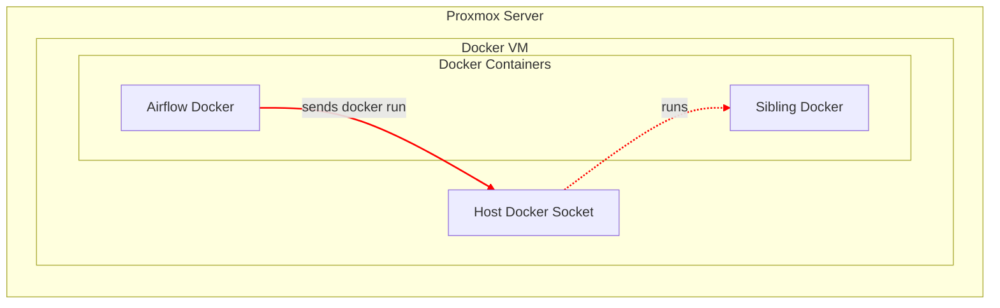

# Airflow setup

I am **orchestrating** all my **Data Ingestion**, **ETL** and other script on an **airflow** server that I am running on
my **dedicated Docker VM** that runs on my **proxmox server** and leverage the scheduled backups of my proxmox server. You can
find more details about my proxmox setup soon. I followed the official documentation
for [Running Airflow in Docker](https://airflow.apache.org/docs/apache-airflow/stable/howto/docker-compose/index.html).
To be able to run Dockers from inside my airflow docker I avoided a complex **Docker-in-Docker** (**DinD**) approach,
which can lead to issues with storage drivers and build caching, I implemented a more robust **Docker-out-of-Docker** (*
*DooD**) configuration. This method involves mounting the host's Docker socket into the Airflow containers, allowing
them to communicate with the host's Docker daemon. This creates"sibling" containers on the host rather than nested ones,
providing a cleaner, more efficient, and stable architecture. This decision was heavily influenced by Jérôme
Petazzoni's, the the author of the feature that made it possible for Docker to run inside a Docker recommendation, read
more about [Using Docker-in-Docker, Think twice.](https://jpetazzo.github.io/2015/09/03/do-not-use-docker-in-docker-for-ci/)

Representation in a chart:

# Remarks on installations

In our team I saw these step where most often forgotten by my team members at Becode.
Do not forget to set the `AIRFLOW_UID` by `echo -e "AIRFLOW_UID=$(id -u)" > .env` an also do not forget to initialize
the airflow by running `docker compose up airflow-init`